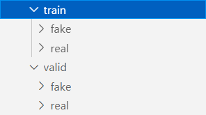
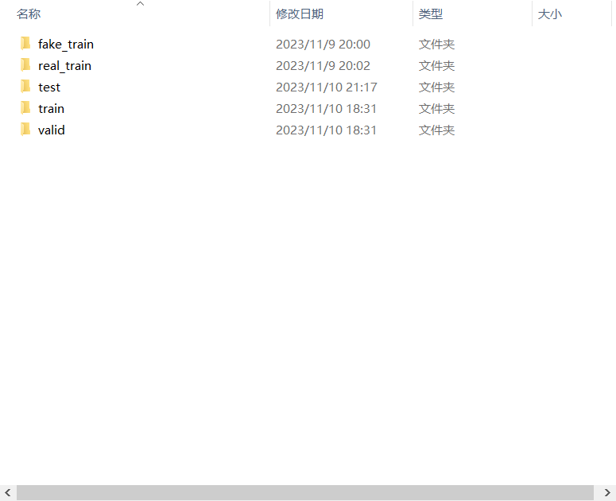

# FAKE_OR_REAL
This is a Competition Works when I participated in the Shandong Provincial Artificial Intelligence Competition

### 部署说明 Version 1.3

代码运行过程中出现任何问题欢迎联系<u>@山东中医药大学  刘兴敏</u> 

***Mail:*** *15689403550@163.com*  

***Tel:***  *15689403550*

---
**本项目运行所需要的库(存储在 `requirements.txt` 文件中)**

> 使用 `pip install -r requirements.txt` 安装所需库

> 注意所有 `jupyter(.ipynb)` 代码需要使用 **Jupyter Notebook** 运行 
```
lightgbm==4.1.0
matplotlib==3.8.0
numpy==1.26.2
pandas==2.1.3
Pillow==10.0.1
Pillow==10.1.0
scikit_learn==1.3.2
scipy==1.11.3
seaborn==0.13.0
skimage==0.0
torch==2.1.1
torchvision==0.16.1
tqdm==4.66.1
```
---

### 其他说明:

**[⭐]** 最重要的代码是 **`MutiResNet.ipynb`** 和 **`utils`** 文件夹中的代码 <p>

如果需要进行模型训练，需要将训练图片进行划分为**训练集**和**验证集**，本文也提供了一个划分的工具 **`reset_dataset.py`**，将划分好的文件分别放在$^{(e.g.)}$ ***`/dataset/train/`*** 和 $^{(e.g.)}$***`/dataset/valid/`*** 文件夹中，使用数据集类(dataset)分别加载


需要声明的是，本题目的指定数据集可以解压为如下格式，分别位于 `./dataset/fake_train` 和 `./dataset/real_train`，如下图所示, 碍于**代码体积原因**，此处不再提供原始数据集，可以直接使用我们**划分后的数据**进行训练


---

**[🏃‍]** 训练过程需要提前对这两个文件夹中的图片进行特征提取，即<u>**噪声(`./utils/noise.py`)**、**对称性(`./utils/symmetric_sift.py`)**、**自相关性`./utils/symmetric.py`**、**其他图片特征`./utils/naturalF.py`等**</u>进行提取，同样的，我们提供了更方便查看这些逻辑的文件，位于 *./dataPreview.ipynb* 文件中

---

**[🏆]** 预测需要指定好文件夹的路径$^{(e.g.)}$ **./input/newest_test/**，该路径下全都为图片，进行预测，执行预测代码，还需要指定模型框架和权重***(.pth)***文件，此处给出了两个可供选择的权值，*`MutiResNet_1114.pth`* 和 *`MutiResNet_1116.pth`*，简单测试后*`MutiResNet_1116.pth`* 得到的结果优于 *`MutiResNet_1114.pth`* 的结果

- 本项目在 **1050ti** 上进行推理预测耗时 **Total prediction time: 7746.9870564937590 seconds** <p>
- 本项目在 **3080ti** 上进行推理预测耗时 **Total prediction time: 2840.2304804325104 seconds** <p>


预测结果将放在$^{(e.g.)}$ **./output/predictions.csv** 文件中，文件格式如下:

| image_path | prediction | prediction_class |
| :-: | :-: | :-: |
|./input/newest_test/test_1.jpg  |0.9502488970756531    | 1 |
|./input/newest_test/test_10.jpg |7.268712352015427e-07 | 0 |
|./input/newest_test/test_100.jpg|0.7194609045982361    | 1 |
|...|...|...|

其中 `image_path` 为文件的路径， `prediction` 为该文件的预测结果， `prediction_class` 为文件最终的预测类别，我们最关注这个字段的内容，因此我们可以将 `prediction` 手动删去， 将`image_path`前的 *./input/newest_test/* 删去，最后执行 **`outputSort.py`** 文件，对整个文件列表进行排序
